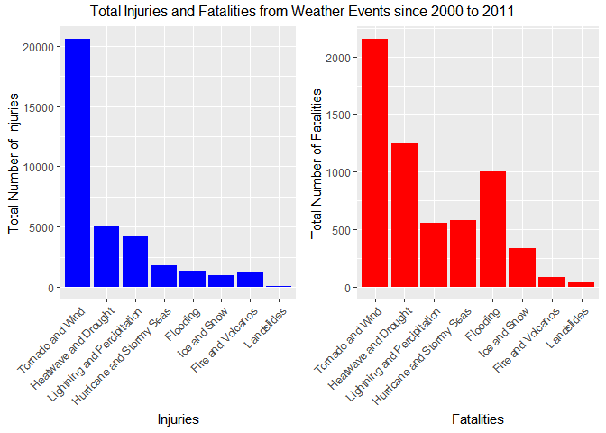

# US NOAA Storm Database Analysis on the Cost and Magnitude of Recent Storms
### Reporducible Research: Peer Assessment #2

## Assignment Overview

The basic goal of this assignment is to explore the NOAA Storm Database and answer some basic questions about severe weather events. You must use the database to answer the questions below and show the code for your entire analysis. Your analysis can consist of tables, figures, or other summaries. You may use any R package you want to support your analysis.

## 1) Synopsis

The US National Oceanic and Atmospheric Administration's (NOAA) storm database tracks characteristics of major storms and weather events in the United States between 1950 and 2011. This database includes when and where these weather events occur, as well as estimates of any fatalities, injuries, and property damage. In this analysis we seek to describe the type of major storm or weather event that have caused the greatest human health and economic cost in the United States. For the analysis, we have focused our attention weather events after January 1, 2000 given the greater completeness of the dataset.

Our overall hypothesis is that Tornadoes will acount for the largest number of deaths and injuries due to the severity of events and the numerous yearly occuranaces. While it is expected that Hurricanes will account for the largest total economic damage. 

From the NOAA storm dataset, we found that on average property damage greatly exceeds damage to corps. It was also determined that Flooding has casued the greatest total economic damage (although it is unclear what amount of Flooding is due to Hurricanes/Stormy Seas). It was also determined that Tornandos have caused the largest number of deaths and injuries.


## 2) Data Processing

### 2.1) Loading Libraries

Load necessary libraries for data analysis and developing results


```r
library(ggplot2)
library(reshape2)
library(dplyr)
# R.utils for bunzip2. It is faster to unzip the .csv.bz2 first instead of directly
# using read.csv(). This was tested by using system.time() for both methods.
library(R.utils) 
# Using gridExtra to combine multiple plots
library(gridExtra)

# Want to remove scientific notation
options(scipen=999)
```

### 2.2) Loading the Data


```r
# Using Cache = TRUE due to time it takes to read the CSV file

# Set working directory, save the zip file URL, the zip file name and CSV name

setwd("~/GitHub/Reporducible_Reseearch-Course_Project_2")

zipURL <- "https://d396qusza40orc.cloudfront.net/repdata%2Fdata%2FStormData.csv.bz2"

rawzipfile <- "repdata_data_StormData.csv.bz2"

csvfile <- "repdata_data_StormData.csv"

# Checks if the CSV file exists. If not, checks to see if the
# zip file is in the directory, if not, then downloads the zip file. The zip file
# is then unzipped

if (!file.exists(csvfile)) {
        
        if (!file.exists(rawzipfile)) {
                download.file(zipURL, rawzipfile, method = "curl")
                bunzip2(rawzipfile, csvfile, remove = FALSE, overwrite = TRUE)
          }
  }

raw_data <- read.csv(csvfile)
```

### 2.2) Modifying the Data and select timeframe

Only want to focus on a select number of key columns for this analysis:   
    1) BGN_DATE: Begining Date  
    2) STATE: State  
    3) EVTYPE: Weather event type  
    4) FATALITIES: Number of fatalitities  
    5) INJURIES: Number of injuries  
    6) PROPDMG: Property damage  
    7) PROPDMGEXP: Property damage exponent  
    8) CROPDMG: Crop damage  
    9) CROPDMGEXP Crop damage exponent  


```r
selected_vars <- c("BGN_DATE", "STATE", "EVTYPE", "FATALITIES", "INJURIES",
                   "PROPDMG", "PROPDMGEXP", "CROPDMG", "CROPDMGEXP")
storm_data <- raw_data[,selected_vars]

# Convert to date class
storm_data$BGN_DATE <- as.Date(storm_data$BGN_DATE, "%m/%d/%Y")


# Calculate the number of weather events before 2000/01/01
before_2000 <- sum(storm_data$BGN_DATE < as.Date("2000-01-01"))

after_2000 <- sum(storm_data$BGN_DATE >= as.Date("2000-01-01"))

before_2000_percent <- paste(round(100 * before_2000 / nrow(storm_data), 2), "%", sep = " ") 

# Calculate the Min and Max date, and the number of years between them and 2000/01/01

min_date <- min(storm_data$BGN_DATE)
max_date <- max(storm_data$BGN_DATE)

after_date <- max_date - as.Date("2000-01-01")
before_date <- as.Date("2000-01-01") - min_date


# Create new storm data subset 
storm_subset <- subset(storm_data, BGN_DATE > as.Date("2000-01-01"))
```

We will also limit the analysis for storms that have occured since only 379134 instances occur before January 1, 2000.  
This represents only 42.02 % of the total dataset occuring over a period of 18260 days.   
In contrast, 523163 weather instance occur after January 1, 2000 over a period of 4351 days.    

However, if we examine the storm EVTYPE dataset, we can see that there are a total of 985 unique weather related classifications.  
The following shows a summary of the number of weather event types. 


```r
head(storm_data$EVTYPE)
```

```
## [1] TORNADO TORNADO TORNADO TORNADO TORNADO TORNADO
## 985 Levels:    HIGH SURF ADVISORY  COASTAL FLOOD ... WND
```

### 2.3) Develop new weather event classification groupings

A large number of these 985 weather events are related and could be consolidated for improved interpretation of the data. In the following steps we will develop 8 new simplified weather classifications. 


```r
# Create a new column that will have the 8 condensed weather event type classifications
storm_subset$EVGROUP <- NULL

# 1) Lightning Storm and Percipitation
storm_subset[grepl("tstm|thunderstorm|lightning|precipitation|rain|hail|drizzle|sleet|
                 wet|percip|burst|depression|fog|wall cloud|sleet|ABNORMALLY WET|EXTREMELY WET",
                 storm_subset$EVTYPE,ignore.case = TRUE),
             "EVGROUP"] <- "Lightning and Percipitation"
# 2) Ice and Snow
storm_subset[grepl("cold|cool|ice|icy|frost|freeze|snow|winter|wintry|wintery|
                 blizzard|chill|freezing|avalanche|glaze|sleet|extreme cold
                 |avalanche|BLIZZARD", storm_subset$EVTYPE,ignore.case = TRUE),
           "EVGROUP"] <- "Ice and Snow"

# 3) Flooding
storm_subset[grepl("flood|surf|blow-out|swells|fld|dam break", storm_subset$EVTYPE,
                 ignore.case = TRUE), "EVGROUP"] <- "Flooding"
# 4) Hurricane and Stormy Seas
storm_subset[grepl("seas|high water|tide|tsunami|wave|current|marine|drowning|
                   hurricane|typhoon|HURRICANE|SEICHE", storm_subset$EVTYPE,
                   ignore.case = TRUE),"EVGROUP"] <- "Hurricane and Stormy Seas"

# 5) Landslides
storm_subset[grepl("slide|erosion|slump", storm_subset$EVTYPE, ignore.case = TRUE),
           "EVGROUP"] <- "Landslides"

# 6) Heatwave and Drought
storm_subset[grepl("warmth|warm|heat|dry|hot|drought|thermia|temperature record|
                 record temperature|record high|dust|saharan", storm_subset$EVTYPE,
                 ignore.case = TRUE), "EVGROUP"] <- "Heatwave and Drought"


# 7) Tornado and Wind
storm_subset[grepl("wind|wnd|storm|tornado|spout|funnel|whirlwind", storm_subset$EVTYPE,
                 ignore.case = TRUE), "EVGROUP"] <- "Tornado and Wind"

# 8) Fire and Volcanos
storm_subset[grepl("fire|smoke|volcanic|RED FLAG CRITERIA", storm_subset$EVTYPE,
                 ignore.case = TRUE), "EVGROUP"] <- "Fire and Volcanos"

# Categorize these new 8 groupings as factors
storm_subset$EVGROUP <- as.factor(storm_subset$EVGROUP)

# Remove the remaining 6 NULL observations 
# 5 are classified as "OTHER" weather events
# 1 is classified as "NORTHERN LIGHTS"

storm_subset <- storm_subset[!is.na(storm_subset$EVGROUP),]
```

Note: we have remove a total of 6 observations that were classified as "OTHER" weather events or "NORTHERN LIGHTS" for the purpose of this analysis.

### 2.4) Calculate absolute property damage figures

Next we need to convert the CROPDMNGEXP and PROPDMGEXP character values into exponential power of 10 values


```r
# Function to convert character values into exponential power of 10 values
Power10 <- function(x){
  if(is.numeric(x)) {x <- x}
  else if(grepl("h", x, ignore.case=TRUE)) {x <- 2} # change h to 2
  else if(grepl("k", x, ignore.case=TRUE)) {x <- 3} # change k to 3
  else if(grepl("m", x, ignore.case=TRUE)) {x <- 6} # change m to 6
  else if(grepl("b", x, ignore.case=TRUE)) {x <- 9} # change b to 9
  else if(x == "" || x == " ") {x <- 0} # change blank to 0
  else {x <- NA} # other symbols like ? are changed to NA
  x
}
```

With this Power10 function, we still need a function to apply this exponential power to the CROPDMG and PROPDMG damage values.


```r
ApplyP10 <- function(dmg, exp) {
  
  P10 <- Power10(exp)
  
  if(is.numeric(dmg)){dmg <- dmg * (10 ^ P10)}
  if(!is.numeric(dmg)){dmg <- 0}
  
  dmg
  
}
```

Now with the Power10 and the ApplyP10 functions, we can calculate the total property and crop damage


```r
# Property damage calculation
storm_subset$Total_PROPDMG <- mapply(ApplyP10, storm_subset$PROPDMG,storm_subset$PROPDMGEXP)

# Crop damage calculation
storm_subset$Total_CROPDMG <- mapply(ApplyP10, storm_subset$CROPDMG,storm_subset$CROPDMGEXP)

# Total property and crop damage
storm_subset$Total_DMG <- storm_subset$Total_PROPDMG + storm_subset$Total_CROPDMG

# Max Property and Crop damage and total max

Max_PROPDMG <- max(storm_subset$Total_PROPDMG, na.rm = TRUE)
Max_CROPDMG <- max(storm_subset$Total_CROPDMG, na.rm = TRUE)
Max_DMG <- max(storm_subset$Total_DMG, na.rm = TRUE)
```

Now combine the economic damage based on the various weather groups


```r
Total_Damage <- aggregate(cbind(Total_PROPDMG, Total_CROPDMG, Total_DMG) ~ EVGROUP, storm_subset, sum, na.rm=TRUE)

# Order from highest to lowest total damage

Total_Damage <- Total_Damage[order(Total_Damage$Total_DMG, decreasing = TRUE),]

# Sorting levels for plots
Total_Damage$EVGROUP <- factor(Total_Damage$EVGROUP, levels=(Total_Damage$EVGROUP))

# Gather the Total_Damage into data frame - use reshape2::melt(), similar to tidyr:

gathered_Total_Damage <- Total_Damage %>% melt(
  id.vars=c("EVGROUP"), measure.vars=c("Total_PROPDMG","Total_CROPDMG"),
  variable.name="DamageType", value.name="Damage") 

# Create Property level for easier grouping
levels(gathered_Total_Damage$DamageType)[levels(
  gathered_Total_Damage$DamageType)=="Total_PROPDMG"] <- "Property"

# Create Crop level for easier grouping
levels(gathered_Total_Damage$DamageType)[levels(
  gathered_Total_Damage$DamageType)=="Total_CROPDMG"] <- "Crop"
```

### 2.5) Aggregate fatalities and injuries

We must now combine the number of fatalities and injuries based on the various weather groups


```r
# Calculate the total number of injuries and fatalities
storm_subset$FATALITIES_INJURIES <- storm_subset$FATALITIES + storm_subset$INJURIES

Total_Human_Damage <- aggregate(cbind(INJURIES, FATALITIES, FATALITIES_INJURIES) ~ EVGROUP, storm_subset, sum, na.rm=TRUE)

# Order from highest to lowest total damage
Total_Human_Damage <- Total_Human_Damage[order(Total_Human_Damage$FATALITIES_INJURIES, decreasing = TRUE),]

# Sorting levels for plots
Total_Human_Damage$EVGROUP <- factor(Total_Human_Damage$EVGROUP, levels=(Total_Human_Damage$EVGROUP))

# Max injuries and max fatalities

Max_injuries <- max(Total_Human_Damage$INJURIES)
Max_fatalities <- max(Total_Human_Damage$FATALITIES)
```

## 3) Results 

Below is a summary of the cleaned and sorted storm dataset:


```r
str(storm_subset)
```

```
## 'data.frame':	523144 obs. of  14 variables:
##  $ BGN_DATE           : Date, format: "2000-02-13" "2000-02-13" ...
##  $ STATE              : Factor w/ 72 levels "AK","AL","AM",..: 2 2 2 2 2 2 2 2 2 2 ...
##  $ EVTYPE             : Factor w/ 985 levels "   HIGH SURF ADVISORY",..: 856 856 856 856 856 244 856 856 856 856 ...
##  $ FATALITIES         : num  0 0 0 0 0 0 0 0 0 0 ...
##  $ INJURIES           : num  0 0 0 0 0 0 0 0 0 0 ...
##  $ PROPDMG            : num  20 20 2 5 2 5 4 30 20 25 ...
##  $ PROPDMGEXP         : Factor w/ 19 levels "","-","?","+",..: 17 17 17 17 17 17 17 17 17 17 ...
##  $ CROPDMG            : num  0 0 0 0 0 0 0 0 0 0 ...
##  $ CROPDMGEXP         : Factor w/ 9 levels "","?","0","2",..: 7 7 7 7 7 7 7 7 7 7 ...
##  $ EVGROUP            : Factor w/ 8 levels "Fire and Volcanos",..: 8 8 8 8 8 7 8 8 8 8 ...
##  $ Total_PROPDMG      : num  20000 20000 2000 5000 2000 5000 4000 30000 20000 25000 ...
##  $ Total_CROPDMG      : num  0 0 0 0 0 0 0 0 0 0 ...
##  $ Total_DMG          : num  20000 20000 2000 5000 2000 5000 4000 30000 20000 25000 ...
##  $ FATALITIES_INJURIES: num  0 0 0 0 0 0 0 0 0 0 ...
```

### 3.1) Summary of the impact on population

This is a summary of the harm to the population as a result of the various weather events


```r
Total_Human_Damage
```

```
##                       EVGROUP INJURIES FATALITIES FATALITIES_INJURIES
## 8            Tornado and Wind    20570       2153               22723
## 3        Heatwave and Drought     4992       1248                6240
## 7 Lightning and Percipitation     4179        556                4735
## 4   Hurricane and Stormy Seas     1817        578                2395
## 2                    Flooding     1365       1004                2369
## 5                Ice and Snow      953        334                1287
## 1           Fire and Volcanos     1199         84                1283
## 6                  Landslides       52         37                  89
```

* The weather event with the largest number of fatalities was a
tornado
on 2011-05-22, that caused
2153 deaths.

* The weather event with the largest number of injuries was a
tornado
on 2011-05-22, that caused
20570 injuries.


```r
health_title <- "Total Injuries and Fatalities from Weather Events since 2000 to 2011"

g_injuries <- ggplot(Total_Human_Damage, aes(x=EVGROUP, y=INJURIES)) + 
  geom_bar(stat = "identity", fill="Blue") + xlab("Injuries") +
  theme(axis.text.x = element_text(angle = 45, hjust = 1, vjust = 1)) +
  ylab("Total Number of Injuries") +labs(fill="Injuries")
  
g_deaths <- ggplot(Total_Human_Damage, aes(x=EVGROUP, y=FATALITIES)) + 
  geom_bar(stat = "identity", fill="Red") + xlab("Fatalities") +
  theme(axis.text.x = element_text(angle = 45, hjust = 1, vjust = 1)) +
  ylab("Total Number of Fatalities")
  
grid.arrange(g_injuries,g_deaths, ncol = 2,
             top = health_title)
```

<!-- -->

From these figures it can be seen that the Tornados and Wind have cause the greatest number of fatalities and injuries. It should also be noted that Flooding causes a greater number of deaths given the relatively few Flooding related injuries. Heatwaves and Drought also appear to cause a greater number of deaths given the relatively few injuries. This is likely due to the nature of the injuries that tend to be more fatal (e.g.. drowning and heatstroke / dehydration).

### 3.2) Summary of the economic consequences

This is a summary of the economic consequences of the various weather events


```r
Total_Damage
```

```
##                       EVGROUP Total_PROPDMG Total_CROPDMG    Total_DMG
## 2                    Flooding  146911207450    5126794900 152038002350
## 8            Tornado and Wind   89484960060    1939134610  91424094670
## 4   Hurricane and Stormy Seas   72504008010    3056872800  75560880810
## 7 Lightning and Percipitation   13066828330    2200042800  15266871130
## 3        Heatwave and Drought     853798730    9628176500  10481975230
## 1           Fire and Volcanos    7114562000     304549430   7419111430
## 5                Ice and Snow     536385030    1320561000   1856946030
## 6                  Landslides     325903000      20017000    345920000
```

* The weather event with the largest property damage was a
flood
on 2006-01-01, that caused
$115000000000 of damage.

* The weather event with the largest crop damage was a
hurricane/typhoon
on 2005-08-29, that caused
$1510000000 of damage.

* The weather event with the largest total propert and crop damage was a
flood
on 2006-01-01, that caused
$115032500000 of damage.


```r
econ_title <- "Total Property and Crop damage from Weather Events since 2000 to 2011"

g_economic <- ggplot(gathered_Total_Damage, aes(x=EVGROUP, y=Damage/1000000)) + 
  geom_bar(stat = "identity", aes(fill=DamageType)) +
  xlab("Event Grouping") +
  theme(axis.text.x = element_text(angle = 45, hjust = 1, vjust = 1)) +
  ylab("Total Economic Damage ($MM USD)") +
  ggtitle(econ_title)

g_economic
```

<!-- -->


From this plot it can be seen that the property damage greatly exceeds damage to crops. This is the case for all weather events, except for Heatwave and Drought which have a high crop damage compared to property damage (as would be expected).


